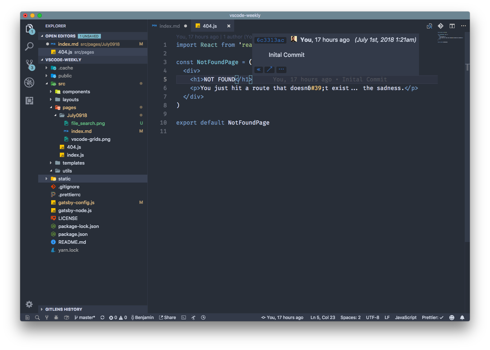
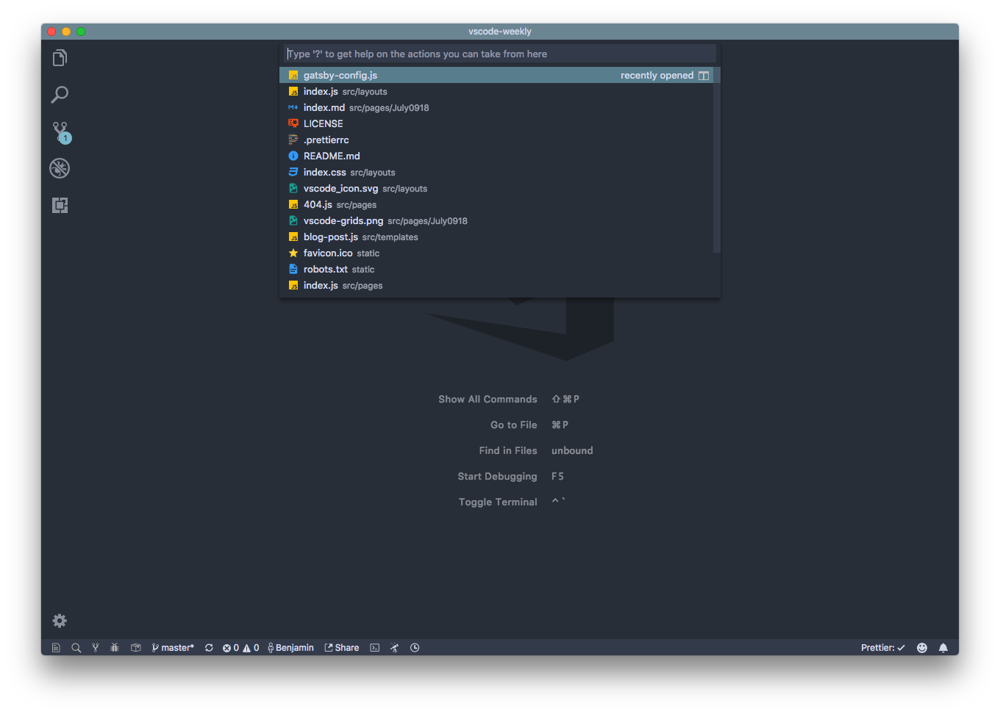

Welcome to the first issue of VS Code Rocks. Today we're going to look into the fairly recent addition of the grid layout. no more single split panes. As well, I take a look at the GitLens extension and show a few quick ways of quickly going through large codebases.

<!-- end -->

# VS Code Feature Spotlight: Grid Layouts

As seen above, Grid Layouts have finally been brought to VS Code. Similar to how you used to drag a tab or file to the side of the editor to make a split pane, now you can do the same in both a vertical and horizontal layout to give a truly powerful editing experience. If you want to adjust the size of the editor panels which have been labelled Groups, grab onto the edge of a group and adjust it to how you see fit.

The potential I've seen over the past few months of using the grid view compared to a bunch of vertical or horizontal panes next to each other is a much more fluid layout experience. If I'm reading through portions of a web application and want a lot of editors open but maybe in smaller panes, I don't need to give those editors half of the window real estate.

# Community Spotlight: GitLens & Nord Theme

GitLens has become one of my go-to extensions I would reccomend to any VS Code user. As in the title, It's a tool which enhances the Git workflow experience in VS Code. The first few things that you can immediately see is on the current line, it displays some annotations on the last change to the line and by whom it was made by. If you hover over it, it expands to a preview showing those changes as well as more indepth information about the commit. If you want to learn more, visit [gitlens.amod.io](https://gitlens.amod.io/).

As well, one of the themes I've been using for the past few months which you can see above is Nord by Artic Ice Studio. It's a crisp blue theme with a low contrast that gives a cool look to Visual Studio Code. It has over 170k installs. If you want to try it out, search Nord in the extensions tab or on the VS Marketplace. I have done very small tweaks to the theme as I have a custom Title Bar color.

# Quick Tips: File Traversal

In small projects, the majority of the files can all be displayed in the explorer view, but as you work on more complex applications, it gets difficult to just use the file explorer to find a file out of hundreds. One thing that is extremely useful to mitigate this is `cmd+p` (`ctrl+p` on Windows & Linux). This displays a input box to search for files.

By default, it will display a list of recently opened files, but it does a fuzzy search as you start typing text into the input box. If you know you are looking for a file called index.js, but know there are a good few of those files across the workspace, it will display them alongside the path in the project.

# Thanks!

I have been using VS Code for the past few years and I always have been active in following what is up and coming in the community as well as the development of the editor itself. I started this project to share the knowledge I've learned over the years as well as a location to share what's next in Visual Studio Code.

As well, I have been starting to develop extensions for VS Code and I want to also give some resources to other devs to show the potential on how you can personally extend VS Code to how you wish.

Stay tuned!
