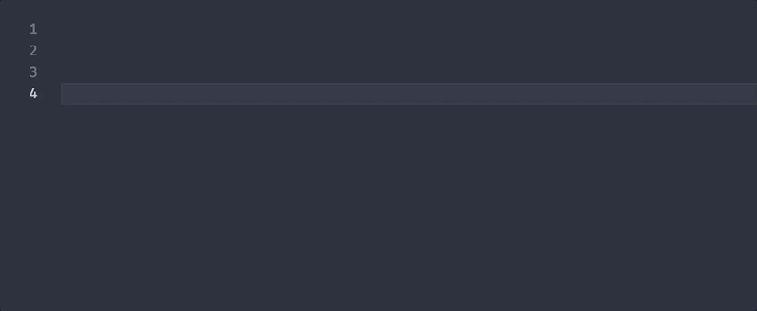

This week, I wanted to do a preview of what is upcoming in VS Code as well as some community spotlight and a quick tip. The endgame for VS Code August 2018 is starting tomorrow and with such, we are approaching a new update and let's take a look at what is going stable in the coming weeks.

<!-- end -->

# VS Code Feature Spotlight: v1.27 Preview

The biggest feature that is upcoming is the new Settings View. The view has been in a public beta in both the stable and nightly builds for a few months, but it is finally coming to become the default view for settings in the August release. It is taking a stark change from the JSON format that existed up to this point. there still is a search bar at the top of the inteface but now rather than a readonly JSON file, users will be presented with a more GUI based interface. Input boxes, dropdowns, and checkboxes now will easily display how users can change each setting.

For Extension developers who create configs for their extensions, there is absolutely nothing needed to make your settings appear properly on the new interface.

Do note if you still prefer the JSON format, it is not going away and you can easily access it by running the `Preferences: Open Settings (JSON)` action in the command palette. As well you can click the options menu on the right side right under the status bar to view various options including settings you've modified, settings that interact with online services, as well as a link to the old JSON file which is still being used behind the scenes.

---

As well, another feature that is upcoming is the option to write OS-specific keybindings. As developers, it may be possible to be working across Windows, MacOS, and Linux and the ability to define custom keyboard shortcuts that may use OS specific keys (alt vs option, super / cmd / windows, etc) and to be able to write keybindings for each OS will allow transferring the keybindings files across systems much easier.


as seen on the right side of the editor in the `keybindings.json` file, you can set the `when` field to the following 6 options: `isWindows`, `isMac`, `isLinux` and the three of those with a ! in front of it which says everything but this OS (`!isMac` equates to `isWindows` and `isLinux`).

---

If you want to test these features or just dig into the nightly build of VS Code and see what is coming, head over to the VS Code Website to the [Download VS Code Insiders](https://code.visualstudio.com/insiders/) page. As well, if you are interested in seeing a list of features that are planned for each release, the VS Code team has public [Iteration Plans](https://github.com/Microsoft/vscode/wiki/Iteration-Plans) on the VS Code GitHub wiki.

# Community Spotlight: Clock in Status Bar and Auto Rename Tag


Clock in status bar is a clean addition to VS Code by adding just what it says: a digital clock into the status bar in the bottom right corner. If you click on it, it will copy the current time into the clipboard as it is presented on your statusbar. When working on MacOS and having the editor in full screen mode, having a clock on my screen without needing to move the mouse up to the menu bar brings a pleasant touch to daily development.

[Clock in status bar](https://marketplace.visualstudio.com/items?itemName=Compulim.vscode-clock)

---


The second extension we are looking at is Auto Rename Tag. It's an extremely simple yet powerful extension that has a single function of renaming matching tags in HTML or XML files. In practice it mainly just works other than some times where it grabs the incorrect closing tag. That said, it is a extension that is simplistic at design and doesn't add any bloat and it seems to act as if it was native to the editor as I have used it.

[Auto Rename Tag](https://marketplace.visualstudio.com/items?itemName=formulahendry.auto-rename-tag)

# Quick Tip: Writing User Snippets

In VS Code, you can write snippets of code through both global snippets or language specific code. If you open the cog in the bottom left section and click User Snippets. then you choose a language which you want to use. A json file will open up and here is an example for inserting a copyright notice into any file.

```json
{
  "Copyright": {
    "scope": "plaintext,html",
    "prefix": "copy",
    "description": "Copyright Notice",
    "body": "Copyright $1 Benjamin Lannon. All Rights Reserved"
  }
}
```

If you want to declare languages in a global snippets file, the property `scope` is a comma seperated list of language identifiers you want to use. `prefix` is the shorthand you will type before running such, and `body` is either a single string or an array of strings for each line of the snippet. If you want to put places to insert the cursor, you can insert symbols including a $ followed by a number and if you want a default placeholder you can insert as follows: `${1:placeholder}` instead of `$1`.

Now you can finally open up a file and go ahead and insert the snippet:



If you find typing something quite often in VS Code, increase your productivity and make a snippet of it.

That's it for this week. If there's anything you are interested in seeing in future issues, tweet at me at [@lannonbr](https://twitter.com/lannonbr).
