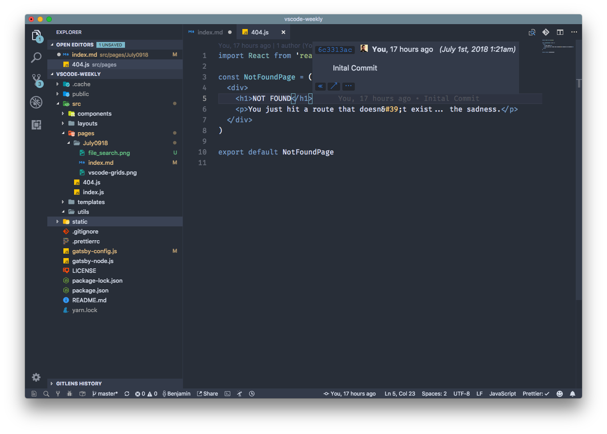
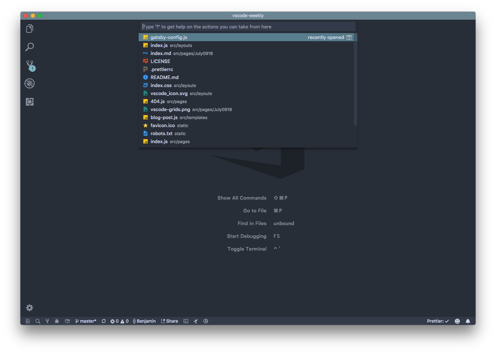

VS Code 1.25 was released last Friday. The biggest feature includes a grid layout for the text editor. no more single split panes. As well, I take a look at the Azure Functions extension and show a few quick ways of quickly going through large codebases.

<!-- end -->

# VS Code Updates: June 2018 Update & Grid Layouts

As seen above, Grid Layouts have finally been brought to VS Code. Similar to how you used to drag a tab or file to the side of the editor to make a split pane, now you can do the same in both a vertical and horizontal layout to give a truly powerful editing experience. If you want to adjust the size of the editor panels which have been labelled Groups, grab onto the edge of a group and adjust it to how you see fit.

As well in this month's update, the Typescript integrations now have been improved further. if you rename a folder in the explorer view, anywhere it is referenced through an import will also be renamed automatically.

There is a bunch of new features, but I reccomend taking a look at the [Release Notes]() for the full listing. If you want to try these features before it is released at the beginning of every month, take a look at the insiders builds.

# Community Spotlight: GitLens & Nord Theme

GitLens has become one of my go-to extensions I would reccomend to any VS Code user. As in the title, It's a tool which enhances the Git workflow experience in VS Code. The first few things that you can immediately see is on the current line, it displays some annotations on the last change to the line and by whom it was made by. If you hover over it, it expands to a preview showing those changes as well as more indepth information about the commit. If you want to learn more, visit [gitlens.amod.io](https://gitlens.amod.io/).

As well, the current theme I've been using for the past few months which you can see above is Nord by Artic Ice Studio. It's a crisp blue theme with a low contrast that gives a cool look to Visual Studio Code. It has over 170k installs. If you want to try it out, search Nord in the extensions tab or on the VS Marketplace.

# Quick Tips: File Traversal

In small projects, the majority of the files can all be displayed in the explorer view, but as you work on more complex applications, it gets difficult to just use the file explorer to find a file out of hundreds. One thing that is extremely useful to mitigate this is `cmd+p` (`ctrl+p` on Windows & Linux). This displays a input box to search for files.

By default, it will display a list of recently opened files, but it does a fuzzy search as you start typing text into the input box. If you know you are looking for a file called index.js, but know there are a good few of those files across the workspace, it will display them alongside the path in the project

# Thanks!

This is first issue. Thank
