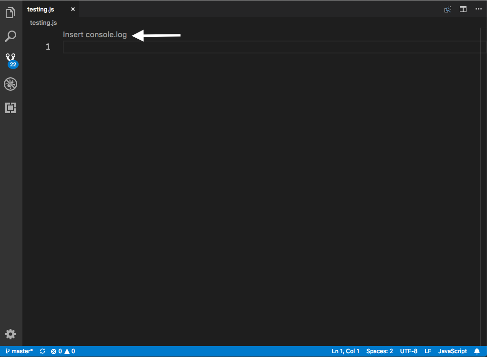
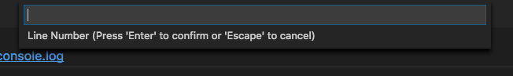
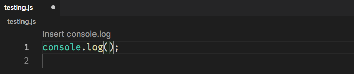

Visual Studio Code has taken many good features built from its sister project Visual Studio, and CodeLens is one of them. They're interactions that allow context aware actions for portions of your code base. Let's dig into building a simple extension to show off the API.

<!-- end -->

# What is CodeLens?

As described by Wade Anderson, CodeLens are "actionable contextual information interspersed in your source code". They're links that you see above lines in your vs code editor that give actions as well as extra information to your codebase. They are similar to the decorator API to give more context to your code, but you can click on CodeLens to take actions based on it.

There was a post in 2017 on the VS Code blog that went into a deeper look at [Extensions using CodeLens](https://code.visualstudio.com/blogs/2017/02/12/code-lens-roundup) which includes well known extensions like GitLens and plenty of others.

To dig into this further, I wanted to make a sample extension that we create a sample CodeLens to add a JS `console.log` snippet into the current file.

---

# Creating a CodeLens

As always, I start off with the [Yeoman generator for VS Code](https://github.com/Microsoft/vscode-generator-code) and choose "New Extension (Typescript)". If you want to see the end result or view the source code in full, head over to [lannonbr/vscode-codelens-example](https://github.com/lannonbr/vscode-codelens-example).

Next, we're going to create the command that we'll activate when we click on the CodeLens. this is a standard VS Code command that we will eventually register in the extension.

```js
async function addConsoleLog() {
  let lineNumStr = await window.showInputBox({
    prompt: 'Line Number',
  })

  let lineNum = +lineNumStr

  let insertionLocation = new Range(lineNum - 1, 0, lineNum - 1, 0)
  let snippet = new SnippetString('console.log($1);\n')

  window.activeTextEditor.insertSnippet(snippet, insertionLocation)
}
```

We ask for a line number of where to put the `console.log` statement and then insert it using `SnippetString` and `Range` instances.

Next, register it through the commands API. Given we want to subscribe to the command so we can clean it up when the context is cleared, we pass the disposable object that `commands.registerCommand` gives us to an array of subscriptions.

```js
let commandDisposable = commands.registerCommand(
  'extension.addConsoleLog',
  addConsoleLog
)

context.subscriptions.push(commandDisposable)
```

As well, we want to add it to the `contributes` field in package.json so we can tell VS Code there will be an command that we will define as we did.

```json
"contributes": {
    "commands": [
      {
        "command": "extension.addConsoleLog",
        "title": "Add Console Log"
      }
    ]
}
```

---

# Attaching to a provider

Next, to provide CodeLens, VS Code has a CodeLensProvider interface. It offers a provideCodeLenses function which you give it the open text document and then you can return an array of CodeLenses.

```js
class MyCodeLensProvider implements CodeLensProvider {
  async provideCodeLenses(document: TextDocument): Promise<CodeLens[]> {
    let topOfDocument = new Range(0, 0, 0, 0)

    let c: Command = {
      command: 'extension.addConsoleLog',
      title: 'Insert console.log',
    }

    let codeLens = new CodeLens(topOfDocument, c)

    return [codeLens]
  }
}
```

For our example, I am putting the CodeLens at the beginning of the document and create an object that sets the text to appear for the CodeLens and what command we want to run.

Then you pass those two to the constructor for CodeLens and return them.

---

# Subscribing to the provider

Finally, we need to give VS Code what context the CodeLens should be placed in. Given this is a JS CodeLens, I want to say that you should only subscribe to it when we have any JS files open which can be done as follows:

```js
let docSelector = {
  language: 'javascript',
  scheme: 'file',
}
```

and then we pass this docSelector to the `languages.registerCodeLensProvider` function with a new instance of our CodeLens provider and then pass the disposable object again to the context subscriptions as we did with the command.

```js
let codeLensProviderDisposable = languages.registerCodeLensProvider(
  docSelector,
  new MyCodeLensProvider()
)

context.subscriptions.push(codeLensProviderDisposable)
```

Lastly, in the `package.json` we also need to add a `activationEvents` field that tells when we should activate our extension which is when we see a file with JS opened which is defined by the "onLanguage:javascript" string.

```json
"activationEvents": [
  "onLanguage:javascript"
]
```

---

# Testing the extension out

Now that everything is set up, we can try out our extension, if we open a debug window by clicking on the debug panel and run the "Extension" launch config.

If we open any JS file, we can now see this new CodeLens at the top:



If we click it, it will open a prompt asking for the line number.



and if we insert a line, for instance 1, it will drop the snippet into the active editor.



---

# Looking Forward

This was just the surface of creating CodeLens, but the usage can be expanded so much further. across any language or library, CodeLens can bring in deeper insights and actions into the development workflow. Although it is a lesser used API, it has a large amount of potential the more it is used.
