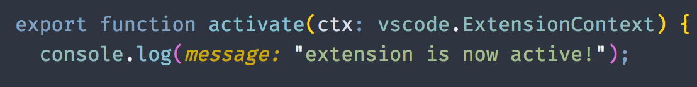
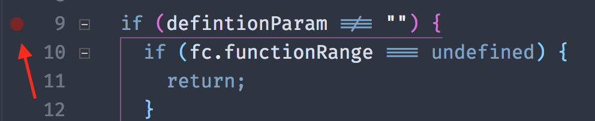
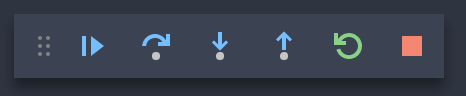
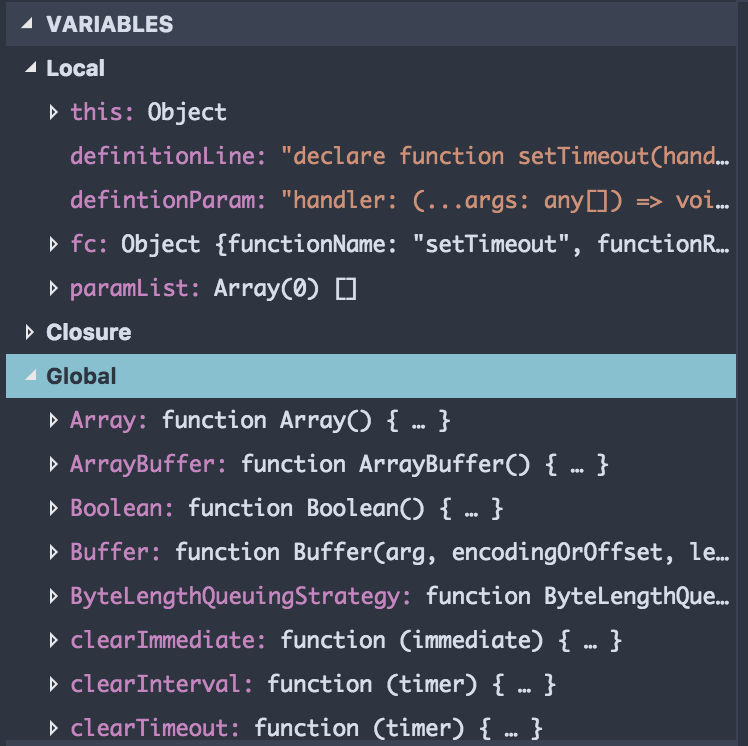
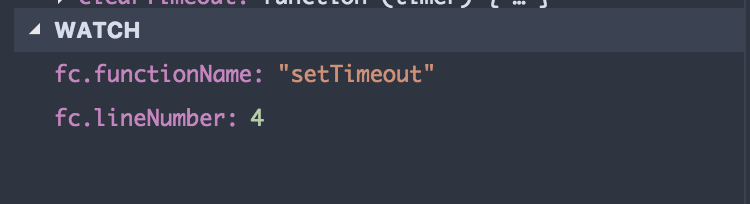
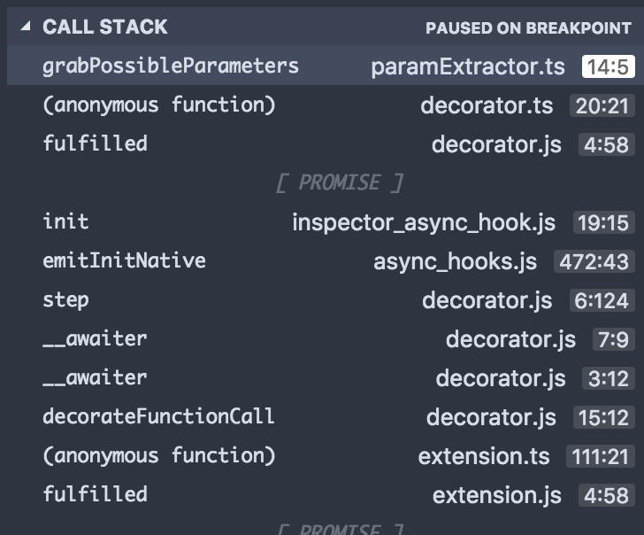
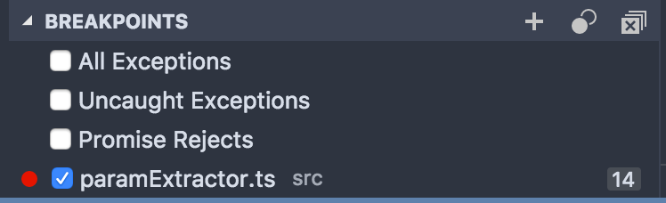
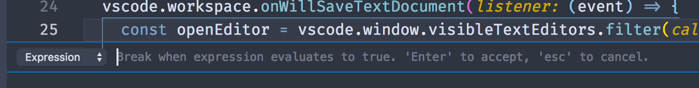

The debugger is one of the most powerful tools in a developer's toolchain. It encompasses you to pause in the middle of the execution and see the context of the program. VS Code has a fairly simple but powerful API that gives you the most amount of information with an intuitive interface. I will go through the basics on how to grasp using VS Code's Debugger.

<!-- end -->

# Debugging basics: log it to the console

When most developers have bugs with their code, they usually begin by printing out specific variables to a terminal or console to check whether the state of a variable is what they expect it to be. When you are just observing a single variable at one location, this can be useful to quickly get the context of your code. If the program is a console-based application, opening the integrated terminal and running your program to see the debugging outputs can allow one to view their code and output side by side.

This can be useful up to a particular point. The moment you start logging out multiple variables across the code or if you want to check if a particular block of code is being called, you can continue putting log statements throughout your code, but it can become quite crowded. As well, you may want to remove all of the debug statements before committing with version control or pushing the code to a production environment.

When you get to this point, using the debugger will provide a huge new world in understanding a running application. To start off, we will want to stop the execution of a program and we can do such with breakpoints

# Let's take a break and step through this

A breakpoint is a tool that states whenever the program is running and hits a specified line, it will completely break the execution. To get a deeper understanding, open the Debug panel and let's start a program in a debugging instance. The Debug panel should be the 4th panel in the activity bar by default or can be focused with the keyboard shortcut `cmd/ctrl+shift+d`.

For the article, I am going to use a JS program but as described later, this can be done with almost any language that supports a debugger. To setup some breakpoints, hover over any line in your code to the left of the line number in the editor and a red circle should appear. If you click such, it will create the breakpoint. You can insert as many breakpoints you want across any file and as long as the code hits your breakpoint, it will pause at each.

Now to actually run through this, click on the green play button at the top of the debug panel. If you are running in node, it will take the current file and start the app. Once it boots up and breaks, you have the entire context of your app at your fingertips. Before diving into everything, I want to go over the few actions you can do to step through your code. in the top of your editor, a new pane appears where you can do a variety of tasks:

* Continue: continue through the execution till another breakpoint is hit or the program ends
* Step Over: Run through the current line but not dive into a function call.
* Step Into: Run through the current line of code and if it calls a function, step into the new function scope.
* Step Out: exit one scope of the function call. If this is the top scope, it will continue and finish the program
* Restart: Restart the application from the beginning.
* Stop: Stop the debugger and cancel the running program.

# Observing the state: Overview of the views in the Debug Panel

Now that we are paused in the execution of a program, a few panes in the Debug panel should now have various pieces of content. Going down each, we start out with Variables, which will present all of the variables in the current context as well as any scope that are loaded in the program. It goes all the way up to the global state of the application which can be also be useful if you want to just look around and see what is native to the runtime.

Next, is the Watch pane. You can insert expressions to be able to view the state of particular variables in your program when you paused to debug your code. This is one replacement you can use to remove breakpoints, but as I will describe later, logpoints can do similar.

Following is the Call Stack pane. It will list the functions which you currently are in and where they were called all the way up the chain of the stack. If you click on them, it will jump to the function call location as shown on the right side of each entry. As well, if the source of external libraries or runtimes are on your machine, clicking on these will also open the source for those function calls as well. Finally, for languages that support async code, it will show when you are running the code when the async call is fulfilled and returns with data.

Finally, we have a pane to view Breakpoints. any breakpoint, conditional breakpoint, or logpoint will pop up here. you can disable it temporarily or remove it if you don't need it anymore. As well, if you want to break on various other things like exceptions or async calls that fail, you can do so here too using the predefined breakpoint options.

# Conditional breaking & Logpoints

In certain instances, you may be hitting a particular piece of code very frequently but only wish to pause when a certain condition is held. This is where a conditional breakpoint comes into use where you can pause the execution only when a boolean expression returns a truthy value.

As well, if you do not want to insert console.log statements everywhere but still wish to have similar functionality, VS Code has a feature in their debugging workflow called logpoints, right click as if you were going to create a breakpoint and choose "Add Logpoint". An input box appears, and you can insert any statement and instead of pausing at the particular line of code, it will instead log out the expression you entered to the Debug Console.

# Debugging across languages

Given VS Code is written in Typescript, the Javascript / Typescript debugging environment is built in by default. It allows you, as described in the previous section, to open any program and almost instantly enter a debugging session with the current file. That said, the VS Code extension API has opened VS Code Debugging to any language that has debugging capabilities.

Whether you are writing C++ and are debugging using GDB, or stepping through Golang with Delve, Most language extensions build the default language debuggers into the extensions to use VS Code's Debug Panel. Once everything is set up for your particular language, you have all of the capabilities that exist with the debugger including breakpoints, the callstack, and watchable variables.

That's a wrap for this week. If you want to learn more, the VS Code docs have even more in-depth documentation on [Debugging in VS Code](https://code.visualstudio.com/docs/editor/debugging). Stay tuned next week for where I dive into VS Code's built in task running support.