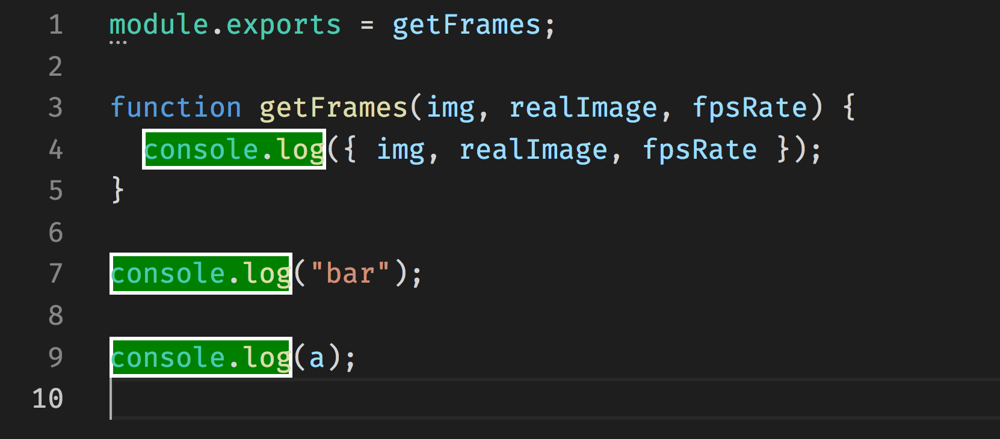

This week, I am going into how you can insert decorations into files with your extenisons. Likely the most well known example that uses decorations is GitLens, but as I show, the interface isn't that difficult to learn.

<!-- end -->

# What are decorations? (Intro and History)

// TODO: Finish this

Talk about a high level way of describing decorations and the capablities they have. List what you can decorate and what properties you can use to stylize the decorations.

Pre-Code 1.0: Decorations API added.
Code 1.3 (June 2016 release): Added `before` and `after` capablities.

# Extensions that use decorations

Decorations has been widely adopted across the extension community and here are a few extensions that show off what can be done with decorations:

* [GitLens](https://marketplace.visualstudio.com/items?itemName=eamodio.gitlens): Display git blame information for the current line
* [Import Cost](https://marketplace.visualstudio.com/items?itemName=wix.vscode-import-cost): Displays size of modules when imported (and when imported while gzipped)
* [Quokka.js](https://marketplace.visualstudio.com/items?itemName=WallabyJs.quokka-vscode): Puts results of JS code inline
* [TODO Highlight](https://marketplace.visualstudio.com/items?itemName=wayou.vscode-todo-highlight): Decorate "TODO", "FIXME", and other specialized comments
* [Colorize](https://marketplace.visualstudio.com/items?itemName=kamikillerto.vscode-colorize): Color CSS colors inline
* [Log File Highlighter](https://marketplace.visualstudio.com/items?itemName=emilast.LogFileHighlighter): Highlights log4net logfiles to make them more readable

# How to set decorations

To show off how to use the decorations, I am going to be writing an example extension that will highlight all locations of `console.log` in JS files

If you want to download the code to follow along, head over to [lannonbr/console-log-highlighter](https://github.com/lannonbr/console-log-highlighter). It was generated with the yeoman vscode generator.

If you open up `src/extension.ts`, The first piece of code is the decoration type.

```js
const decorationType = vscode.window.createTextEditorDecorationType({
  backgroundColor: 'green',
  border: '2px solid white',
})
```

This describes how we want to style the decoration. For this example, I am going to just decorate the text itself, but if you are interested, you can add `before` and `after` objects to add pseudo elements to the decoration. (GitLens uses this to push the inline blame after the end of the line)

The following things can be styled which map to their respective css properties:

* border
* outline
* color
* backgroundColor,
* fontSize
* fontWeight
* textDecoration
* letterSpacing
* opacity

As well, you can insert these into `light` and `dark` objects so you can customize how it will appear for specifically light or dark color themes.

Next in the `activate` function, I have a event listener which will watch for document saves. Any time the file is saved this will be called. I grab the editor open and pass it into a decorate function which will do the heavy lifting on setting the decorations:

```js
vscode.workspace.onWillSaveTextDocument(event => {
  const openEditor = vscode.window.visibleTextEditors.filter(
    editor => editor.document.uri === event.document.uri
  )[0]
  decorate(openEditor)
})
```

Following is the decorate function which takes a vscode.TextEditor as a parameter. First we setup some boilerplate by grabbing the text from the editor, setting up a regex to look for console.log, and as well create an array where the decorations will live.

```js
let sourceCode = editor.document.getText()
let regex = /(console\.log)/

let decorationsArray: vscode.DecorationOptions[] = []
```

Next I loop over each line of the code and will try looking for console.log. If I can find it, I create a range for which the decoration will cover. Each decoration requires at least a range which includes a starting and ending position for where the text is. In VS Code internally, line and columns are 0-indexed, so if we had a file have console.log at the beginning of the document, it would start at line 0, col 0.

```js
const sourceCodeArr = sourceCode.split('\n')

for (let line = 0; line < sourceCodeArr.length; line++) {
  let match = sourceCodeArr[line].match(regex)

  if (match !== null && match.index !== undefined) {
    let range = new vscode.Range(
      new vscode.Position(line, match.index),
      new vscode.Position(line, match.index + match[1].length)
    )

    let decoration = { range }

    decorationsArray.push(decoration)
  }
}
```

After creating the range, we create a object that contains that range and then we push it into the decorationsArray.

After looping through the code, we then pass the array of decorations we created as well as the decoration type to the editor to be created.

```js
editor.setDecorations(decorationType, decorationsArray)
```

Here is the entire source for the extension.ts file in whole:

```js
import * as vscode from 'vscode'

const decorationType = vscode.window.createTextEditorDecorationType({
  backgroundColor: 'green',
  border: '2px solid white',
})

export function activate(context: vscode.ExtensionContext) {
  vscode.workspace.onWillSaveTextDocument(event => {
    const openEditor = vscode.window.visibleTextEditors.filter(
      editor => editor.document.uri === event.document.uri
    )[0]
    decorate(openEditor)
  })
}

function decorate(editor: vscode.TextEditor) {
  let sourceCode = editor.document.getText()
  let regex = /(console\.log)/

  let decorationsArray: vscode.DecorationOptions[] = []

  const sourceCodeArr = sourceCode.split('\n')

  for (let line = 0; line < sourceCodeArr.length; line++) {
    let match = sourceCodeArr[line].match(regex)

    if (match !== null && match.index !== undefined) {
      let range = new vscode.Range(
        new vscode.Position(line, match.index),
        new vscode.Position(line, match.index + match[1].length)
      )

      let decoration = { range }

      decorationsArray.push(decoration)
    }
  }

  editor.setDecorations(decorationType, decorationsArray)
}
```

Now if you open the debugging menu or press `F5`, a debugging instance will open up. Open up a JS file that has a few console.log calls and press save and you should see the decorations in action:



# Gotchas

// TODO: Finish this

Some things to know when using decorations:

Mention things that are gotchas (updating decorations, creating TextEditorDecorationTypes outside functions so the types stay consistent, etc)

That's it for this week. In a future post, I am going to discuss a sister-api to this, CodeLens, which adds actionable decorations above code lines
