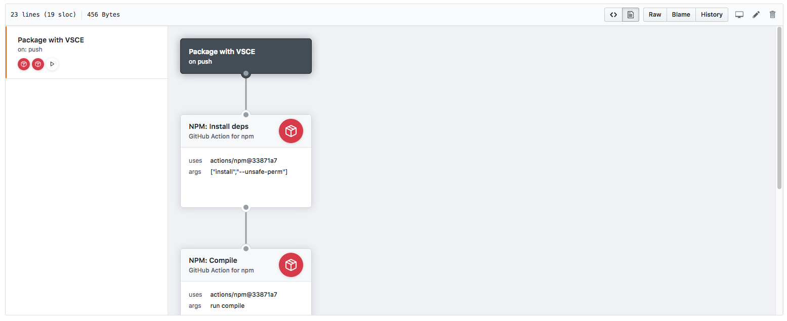
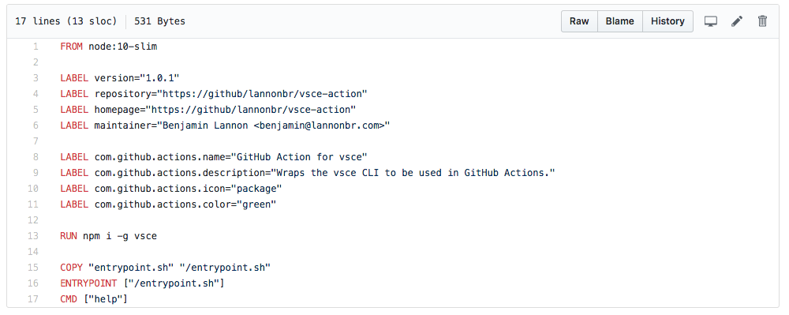
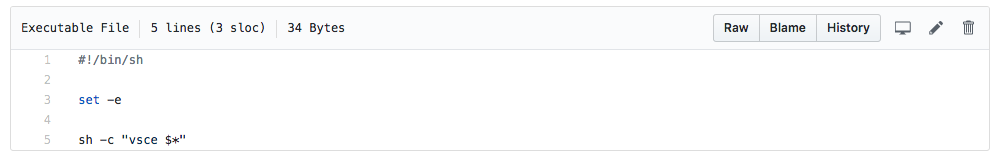
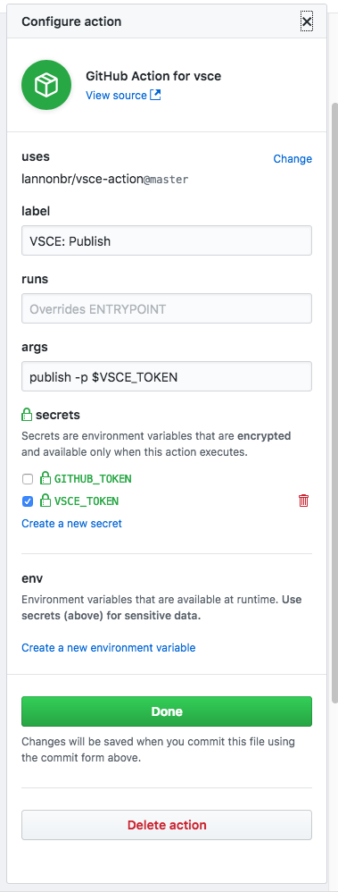

GitHub Actions is the advancement of integrations into the GitHub API. It allows on over 20 GitHub events to run workflows that empower and enhance GitHub workflows. Today I want to go into what GitHub Actions can do and how I'll be using them to empower the deployment of my VS Code extensions.

<!-- end -->

# GitHub Actions Overview

Actions at the essence are managed docker workflows on GitHub. You start with a trigger you wish the workflow you want to run on such as `push` for when a commit is made to the repo, `pull_request` for when a PR is made or modified, or any of the other events described in [GitHub's docs](https://developer.github.com/actions/creating-workflows/workflow-configuration-options/#events-supported-in-workflow-files). Following such, you define actions that you wish the workflow to run to which spin up docker containers to run anything you wish.

On GitHub itself, you can interact with these workflows with a visual editor they created. As it is a series of steps, you can define a path of actions to run through and if any fail or return a neutral state, the workflow will cancel the rest of the execution. While the example below of the visual editor shows a single row of actions, you can define many actions to be run in parallel.



The backend of these are saved in a .github/main.workflow file in the repo you want it to run in. The workflow behind the scenes is written in HCL, which is the [HashiCorp Configuration Language](https://github.com/hashicorp/hcl). Here's the source of the entire workflow that was partially shown above to package and publish a VS Code Extension on any push to the example repo.

```
workflow "Package with VSCE" {
  on = "push"
  resolves = ["VSCE: Publish"]
}

action "NPM: Install deps" {
  uses = "actions/npm@33871a7"
  args = ["install", "--unsafe-perm"]
}

action "NPM: Compile" {
  uses = "actions/npm@33871a7"
  args = "run compile"
  needs = ["NPM: Install deps"]
}

action "VSCE: Publish" {
  uses = "lannonbr/vsce-action@master"
  args = "publish -p $VSCE_TOKEN"
  needs = ["NPM: Compile"]
  secrets = ["VSCE_TOKEN"]
}
```

For some explaination, I install the dependencies for the extension with the NPM action, compile the extension, and then publish the extension with my vsce action. Let me go a little into the vsce action in further detail.

# VSCE Action

An action I created a week ago was the power to use VSCE in a workflow. VSCE for those who may not know is a CLI tool created to package and deploy VS Code Extensions. With such, I wanted to create a extremely simple interface to interact with it. The repo is on GitHub at https://github.com/lannonbr/vsce-action.

What you'll see next is all the code needed to implement the action:





In terms of actual lines of code that would be required, that is 8. With any Docker container, the Dockerfile which is the first image describes how to build the container and what it should do when executed. If you are used to Docker, this looks like a regular Dockerfile. If not, it's fairly simple to follow. you start with a `FROM` field to say what image we should start with. I am using "node:10-slim" which offers a lightweight debian image that has node 10.x pre-installed. Next, the two sections are some metadata on the container and action. the first 4 define regular metadata on the container while the second 4 are for GitHub specific metadata to stylize the visual editor with stuff such as the display name and icon. Next, I am running a few commands to install VSCE and copy some files into the container itself. Then, the `ENTRYPOINT` field tells what file to execute when the container spins up and as seen in the second image, it's just a simple shell script to run vsce with the specified sub-command and arguments.

Now when using it in a workflow, you drag a new line from a trigger or action to create a new action. You define the action to run by typing in the path which can be either from Docker Hub or a github repo with the syntax of `user/repo/path/to/action@(branch or sha)`. I am here using the master branch for the action. Next, you can now define what to do with the action in the args field. Here I am going to say to publish an extension.



You can see that I am passing in an environment variable called `VSCE_TOKEN` which is a Personal Access Token from Azure to allow the container to get credentials to push the extension up to the VS Marketplace. In each repo where you use the extension, you can define secrets if you wish to hide sensitive credentials from public, but if you wish to use environment variables that aren't sensitive, you can add them in this panel as well.

# Possible workflows

Now that I built the VSCE action, it can be used for almost anything. I have one particular usecase I wish to build which is deploy my extensions once a night as a nightly beta build if the master branch changed since.

With this, when writing actions, build them to be fairly simple so they can be placed into any workflow. If it looks like the action is doing more than one job, split it into two actions. When you plug an action into your workflow, you should not need to examine the action other than to understand the basic tools of it.

# Limitations

There are a few exceptions to the breadth of what you can do with Actions. You can create as many workflows you want in a repo, but you're limited to 2 workflows running simultaneously. As well, the workflows themselves have a limit of about a hour of runtime and can only hold 100 actions per workflow, which honestly for most scenarios will be alright.

As well, you get an environment for each workflow, so the actions can pass data between each other. The resources for each are as follows:

- 1 VCPU
- 3.75GB of RAM
- 100GB disk space
- Write access to this environment's filesystem.
- Network access

For the average consumer, that likely will be plenty, but in general, I would say Actions is another branch of the serverless world. One creates ephemeral containers that will run short-lived tasks based upon events from GitHub. It is a different mindset if you are not used to serverless, but the perks are you don't need to focus on the infrastructure that your code for these actions run, but rather just build the actions and let GitHub run them.

Finally, GitHub Actions is still in a beta phase, so if you have access to it, you will only be able to implement workflows on private repos until actions hits General Availability. That said, do share actions you build on the [Awesome-Actions](https://github.com/sdras/awesome-actions) repo so when it goes public, developers will be able to see and use your actions.

If you want to learn more, head over to the [GitHub Docs on Actions](https://developer.github.com/actions/). Otherwise, stay tuned next week.
