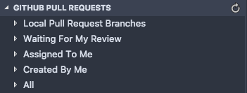
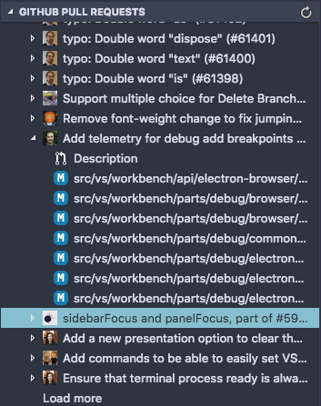
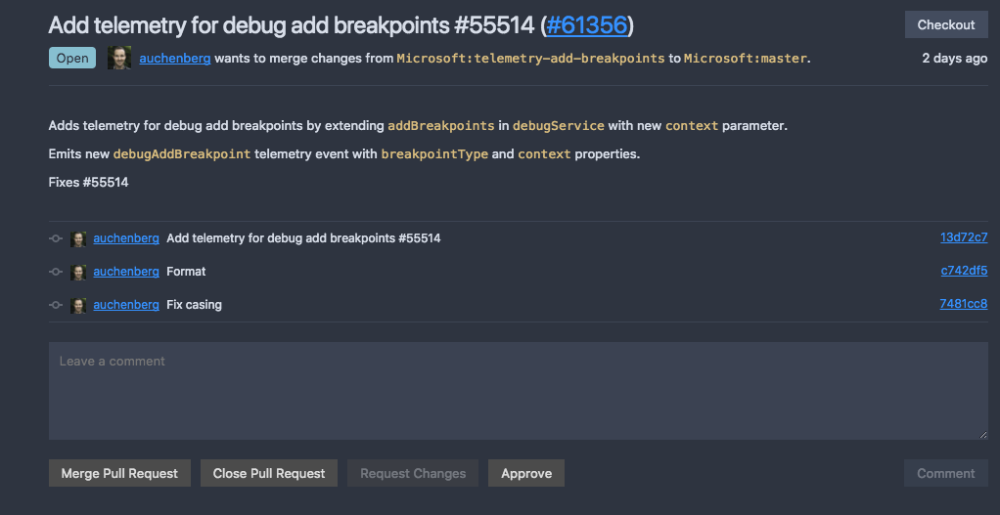
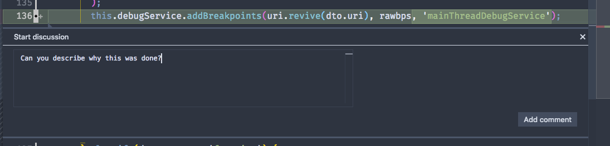

Over the 2nd half of 2018, the GitHub and Microsoft teams have collaborated on an extension to integrate the PR workflow directly into VS Code. It brings the ability to manage PRs in the editor and simplifies the experience of reviewing pull requests. Today I am going to dig into the features it currently supports as well as some features that are coming soon to the extension.

<!-- end -->

# Getting Started

To begin, you can download the extension from the VS Marketplace like other VS Code extensions:

[GitHub Pull Requests](https://marketplace.visualstudio.com/items?itemName=GitHub.vscode-pull-request-github)

Once it is installed, there will be a notification that appears at the bottom of the screen requesting you to login to GitHub. This will be done so you can use your account when interacting with the extension. You will be logged in if you go through everything and see your username next to the GitHub logo in the left side of the status bar.

Next, if you open up the Source Control tab in the activity bar, you will see a new view at the bottom for GitHub Pull requests. I am going to examine the VS Code repo to show things off.

It shows a bunch of different categories so if you know you want to look at a PR that was assigned to you or that you created, you can easily navigate to it. If you just want to scroll through all open PRs on a repo, open the `all` item. The PRs presented here will include all git remotes so if you are working on a project in a fork, if you add the upstream url to your local directory with `git remote add`, the PRs from the upstream repo will appear. Now let's say we want to open a PR. When you click on one of the PRs presented, it displays the files that have been changed in the pull request as well as a description view which I'll be going over shortly.

The real magic appears when you open these views.

# Reviewing PRs

The description view of a PR is a custom view that shows off the majority of the content that you would see if you opened the PR up on GitHub.

It displays comments and commits in the PR. If you want to leave a comment on the PR, you can type in the box at the bottom and it will be posted on the PR just as if you left a comment through the website.

As well, what is even nicer compared to the usual workflow is all you need to do to test the change yourself is click the Checkout button in the top right corner. It will pull down the commits to a virtual filesystem and checkout into it, so you can debug an application with the new changes in a much simpler workflow.

As well, if you open up one of the staged files to be merged in, it will present it in a diff view similar to if you made changes in a local file. Commenting support exists directly in the diff editor as if you opened a file in the PR view on GitHub's website. If you click on the white gutter next to changes, a textbox will dropdown which you can write comments on the code inline.

# Some Upcoming Features

Similar to how VS Code is developed, the GitHub PR extension has monthly iteration plans to lay out features / fixes that should be done for the month's release.

One feature that is going to be interesting to see upcoming is the ability to create PRs directly in VS Code with the extension. Ashi Krishnan from GitHub has been currently working on a PR to do this (which is still open and a work-in-progress as of writing this) and can be viewed here: [vscode-pull-request-github#554](https://github.com/Microsoft/vscode-pull-request-github/pull/554).

As well, I am interested in seeing the ability to view status checks in VS Code on the repo (There currently is an issue opened for it: [vscode-pull-request-github#457](https://github.com/Microsoft/vscode-pull-request-github/issues/457))

As well, the two teams have been working on some features that are platform agnostic so eventually other git hosting providers such as GitLab or Bitbucket could have similar experiences integrated into VS Code.

The extension itself is still in a preview state so the team would love feedback and try to figure out how to continually develop it, but from testing it personally, I am extremely impressed with the progress so far. Bringing a PR workflow into the editor itself is a great experience since you won't need to context switch between GitHub in the browser and your text editor.
