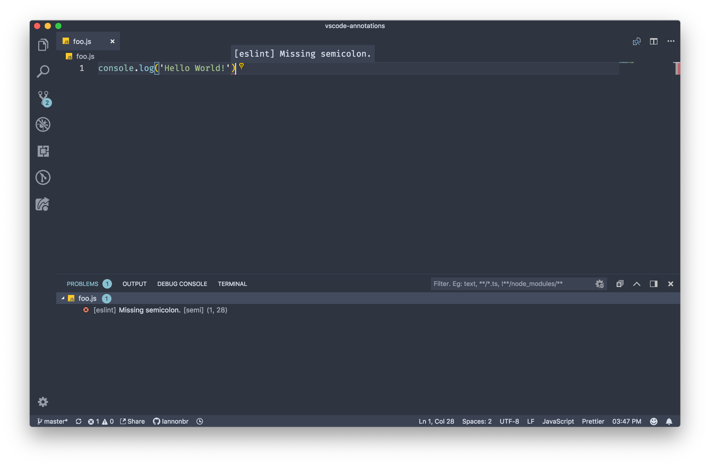

Linters and Code Formatters set up a strict standard to stylize your code. It is useful when working in teams so you don't have to disagree on topics like tabs vs spaces. There are a variety of code formatters / linters out there, but today I'm going to dive into 4 linters / code formatters for JavaScript & TypeScript that have extensions for Visual Studio Code.

<!-- end -->

# What is a Linter / Code Formatter?

Linters & Code Formatters live in the space of stylizing code. I could write a line of JS in two different ways like as below:

```js
console
  .log('hello world!')
```

or

```js
console.log("hello world!");
```

Functionally speaking, they both print out "hello world" to the console, but they look different in a variety of ways. the first example is split across two lines, has single quotes around the string, and there is no semicolon at the end. On the other side, the second example is on one line, uses double quotes and has a semicolon.

JavaScript allows you to write things in a variety of ways that still allows you to get the same end result. With this, it may be good to set up a set of rules to state how the code should be structured. A linter is a program that has a collection of these rules to define how the code should be written and tells you if you wrote something that differs from it. Some popular JS linters include ESLint and JSHint. As well, given JavaScript is not a compiled language, these linters can find bugs that may appear at runtime before you execute said code. As well, code formatters will oblige to either the rules in a linter or their own rules and will change JS files to align to those rules for you.

With that, lets dive into the 4 extensions.

# ESLint

[ESLint](https://eslint.org/) is an extremely well known linter for JS developers. It has a set of rules to how code should be styled but the perks of it is it extremely customizable and extendable. If you don't like a rule or want to create a rule, it is as easy as downloading a plugin or adding something to a config file to change it.

The VS Code Extension written by Dirk Baeumer integrates this into your editor. It will by default use the .eslintrc file to load in your config for ESLint and then will run it when you are editing files. When it picks up something wrong, it will insert some squiggly lines and add an entry to the Problems tab in the panel view.



As well, given it is using the ESLint CLI behind the scenes, if you add any plugins or use presets, it just will work. As well, you can enable the `eslint.autoFixOnSave` setting in your user settings which will fix any errors as soon as you save.

If you want to grab this extension, see here:

https://marketplace.visualstudio.com/items?itemName=dbaeumer.vscode-eslint

# Standard

[JavaScript Standard Style](https://standardjs.com/) is another linter / formatter that is more opiniated compared to ESLint where it has a much smaller scope of [rules](https://standardjs.com/#standardjs--the-rules) that is bases itself on. The VS Code extension for it written by Sam Chen again, similar to the ESLint extension, will integrate Standard into VS Code. Compared to ESLint though, Standard just needs to be installed either in your node project locally or globally on your machine with `npm install standard` or `npm install -g standard` and does not require any config files to run.

In essence, Standard has a different style compared to the default ESLint config, but all of the features of noting linting warnings or errors still exist with Standard. To download the extension, click the link below.

https://marketplace.visualstudio.com/items?itemName=chenxsan.vscode-standardjs

# Prettier

Compared to the two previous extensions, [Prettier](https://prettier.io/) is strictly a code formatter. On top of doing JS code formatting, there is a lot of other web related languages, and the team is working on support for other languages like Java, Python, Swift, among others. The VS Code extension for Prettier will run it whenever you run the `Format Document` or `Format Selection` actions, and if you enable `editor.formatOnSave`, it will run it after you save the document.

Prettier is one of the strictest of these tools given it enforces a defined way of how the code should look and some people may not like it, but like all of these projects, you can configure them fairly easily. Here's a link to how to [configure Prettier](https://prettier.io/docs/en/configuration.html). You can grab the extension here:

https://marketplace.visualstudio.com/items?itemName=esbenp.prettier-vscode

# TSLint

Finally, TSLint is the go-to linter for TypeScript. VS Code has a typescript language server that checks for some errors by default, but TSLint and more importantly, the TSLint plugin written by Erich Gamma will increase the errors outputted in TypeScript files in Visual Studio Code.

The TSLint extension works in an extremely similar vain to ESLint or other linter extensions, but specifically will lint TypeScript. As well, there is a variety of [community defined presets](https://github.com/palantir/tslint#custom-rule-sets-from-the-community) for integrating specific rule sets into TSLint.

The extension can be downloaded here:

https://marketplace.visualstudio.com/items?itemName=eg2.tslint

# Words of Advice

Although these tools do similar things, I would recommend against using them together by default. They sometimes can step over each due to precedence, so I would suggest if you want to use some of them together, try looking up documentation to see if they will work properly in the same workspace.

As well, if you are working on a project that already has a particular code formatting / linting configuration already set up, do not use another linter / code formatter as it will cause issues down the road. Luckily, VS Code allows you to disable extensions for particular workspaces, so if you have a bunch of projects you use Prettier on, but one project uses ESLint with Standard, you can [disable the extension](https://code.visualstudio.com/docs/editor/extension-gallery#_disable-an-extension) for just that single project.

# Bonus: Don't commit without checking linting with Husky

[Husky](https://github.com/typicode/husky) is a tool that you integrate into a node project to relieve yourself of some of the headaches with CI. If you have these tools like ESLint or TSLint up in your Continuous Integration pipelines, any time someone makes a PR or push to your repo, they can run and tell you if you have any linting bugs in your code. What husky does is runs any task you wish when you press run `git commit` or `git push` and if the task fails, it will respond with an error and will not push or commit the code. If you use VS Code's version control features, when you click the check mark to commit something, husky will be run to make sure there are no linting errors and brings the issues up before they appear in a CI environment. Using Husky with the extensions I discussed is just another safety precaution to double check that there are no bugs that may have gone unnoticed.

If you have set up a `lint` task in your package.json scripts field, all you need to do to get husky working the following:

Install it through NPM or Yarn as a dev dependency (given your users of this package or application don't need it given it is just used in development)

```
npm install --save-dev husky
```

and add a `husky` field in your package.json with the particular git hooks you want to define

```json
// package.json
{
  "husky": {
    "hooks": {
      "pre-commit": "npm run lint",
      "pre-push": "npm run lint"
    }
  }
}
```

You can use any [git hook](https://git-scm.com/docs/githooks) with Husky.

That's it for this week. I hope adding some of these extensions into your workflow will make your code easier to read but also easier to maintain down the road. I have used all four of these extensions as well as Husky for different projects and it helps a ton making sure I don't run into formatting issues down the road.
