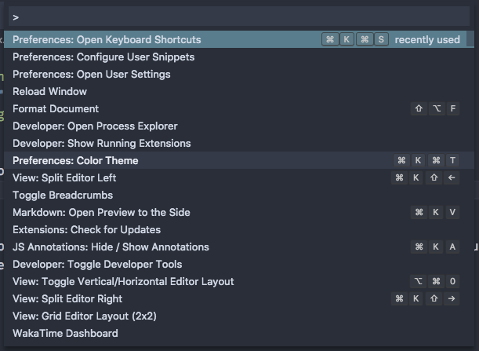
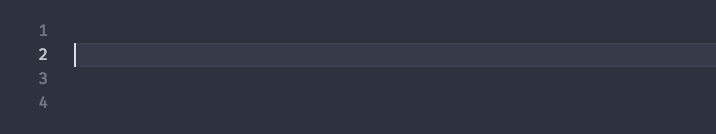

VS Code has many ways to control the editor through menus, the keyboard, panels in the sidebar, and many more. Today, I want to go into how you can control the majority if not all of your editor using the keyboard alone.

<!-- end -->

I used Vim previously before switching to VS Code and the Vim philosophy is to continually use keyboard shortcuts to make programming much faster as you become more advanced in Vim. Switching to VS Code, it is more visually based, but as I show here, the majority of the editor can be controlled with keyboard shortcuts. Just as a note, a lot of keyboard shortcuts which use the cmd key on MacOS are mapped to the control key on Windows and Linux so I will be using either style throughout the rest of the article.

# Command Palette: cmd/ctrl+shift+p or F1

One of the most powerful keyboard shortcuts is to open the command palette with ctrl/cmd + shift + p. Absolutely any action you can do with a mouse is actionable through the command palette. Start typing whatever you wish to do and it will appear in the search results. As well, on the right side of any action, if it has a mapped keybinding, it will present it to you.

For things you use frequently including a majority of things that will be discussed later in this article, learning those keyboard shortcuts will make it much easier rather than searching for it time and time again.

# File Palette: cmd/ctrl+p

A few weeks ago, I mentioned this keyboard shortcut of opening a file picker. For large-scale projects, being able to open a file by starting to type in the first few letters and then selecting an option in a panel similar to the command palette makes browsing a project extremely fast. For more info, head over to the [August 19 Weekly digest post](../Aug192018) for more info.

# Adding cursors above & below - cmd/ctrl + opt/alt + up/down arrow

VS Code allows usage of having multiple cursors across lines so you can modify code in multiple places at once. If you wan't to add a cursor a line above or below where the current cursor is placed, press cmd+opt+up/down or ctrl+alt+up/down to insert the cursors.

# Zen Mode: cmd/ctrl+k z

When wanting to get into the zone, VS Code's native zen mode will help out with such. It gets rid of the sidebar, tabs, goes fullscreen, and pushes everything away to allow for a distraction free environment. If you have a split editor, it will keep those splits open in zen mode which can be useful at times, but a personal feature request I would like to see in VS Code is a zen mode with only one editor visible.

# Switching Sidebar views

All of the default sidebar views are easily accessible by the keyboard using a fairly simple mnemonic. if you press cmd/ctrl+ shift + the first letter or letter you expect, it will open the view:

* `cmd+shift+e`: Explorer view
* `cmd+shift+f`: Search view
* `cmd+shift+x`: Extensions view
* `cmd+shift+d`: Debug view

The only one that differs is the git view which is accessible by `ctrl+shift+g` on all operating systems.

# Bonus: Your own keybindings!

If you don't prefer a keybinding VS Code has by default, you can change it to whatever you wish. If you open `Preferences: Open Keyboard Shortcuts` in the command palette or open the cog in the bottom left corner of VS Code and click "Keyboard Shortcuts", you will see a table similar to the one at the top of this post. you can search for whatever action you wish to change and if you double click on it, a modal will appear and you can enter the keyboard shortcut you wish to use. VS Code also intelligently lets you know that if the keybinding you choose is already in use or not so you don't overwrite something that is already in use.

That's it for this week. If you have any particular keybindings that you use a ton that I missed and would like to share with the community, Send a tweet to me at [@lannonbr](https://twitter.com/lannonbr).
