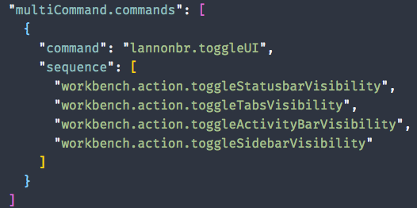
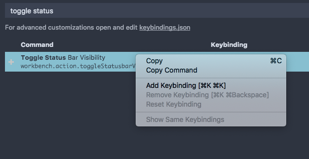
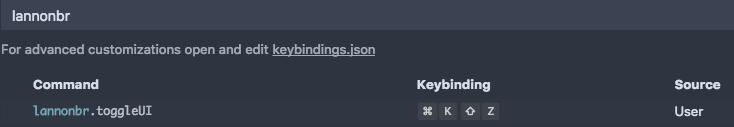

VS Code can be used with a UI-heavy workflow as well as a keyboard-driven workflow. With the latter, commands can be used to toggle the majority of the UI off and with a neat Extension, you can toggle UI to almost just the editor itself with a single keyboard shortcut.

<!-- end -->

# Toggle UI

A variety of UI components can be toggled through commands. Here is the main list of components:

* View: Toggle Status Bar Visibility
* View: Toggle Tab Visibility
* View: Toggle Activity Bar Visibility
* View: Toggle Side Bar Visibility
* View: Toggle Minimap
* View: Toggle Breadcrumbs
* View: Toggle Panel

You could go one by one and toggle them off if you prefer not to use them or want a minimal editor, but it would be extremely convenient if you could toggle many at once.

# Multi-command VS Code Extension

By default, you cannot run multiple commands in a row with a single keyboard shortcut in VS Code. That said, [ryuta46](https://github.com/ryuta46) on GitHub created an extension that allows you to create commands that run a series of commands.

https://marketplace.visualstudio.com/items?itemName=ryuta46.multi-command

With this, if you open the user settings JSON, you can use the `multiCommand.commands` property to create new commands.

I created a command called "lannonbr.toggleUI". Then I write the name of each command I want to run. If you do not know what the name of the command is, you can open the keyboard shortcuts view and if you search for the command, right click on the command and click "Copy Command", it will copy the command string which is under the display name of the command to your clipboard.

# Hide that UI

Now that the command is made, we can setup a keybinding for it. Again, in the keyboard shortcuts view, if you search for the command you made, you can click on it and set up a keybinding for it. I set my command to `cmd+k shift+z` (Since it provides a similar UI to the zen-mode which has a keybinding to `cmd+k z`)

Now if you press the keybinding, all of the various commands you set to run will go in sequence. It allows you to have a windowed mode but clear all of the regular UI to act similar to the full screen zen-mode.

Currently the multi-command extension doesn't add the command to the command palette, but the extension is on [GitHub](https://github.com/ryuta46/vscode-multi-command), so if someone would wish to investigate if they could add something like that, the maintainer is likely willing to take PRs.

Overall, having the ability to push all of the UI out of the way can be extremely useful when doing a deep dive in your code or writing in VS Code, like how I do with this blog. As well, the multi-command feature would be a great addition into the main VS Code repository but having an extension that implements it works anyways. It's a simple feature but can be extrapolated into a variety of more complex workflows.