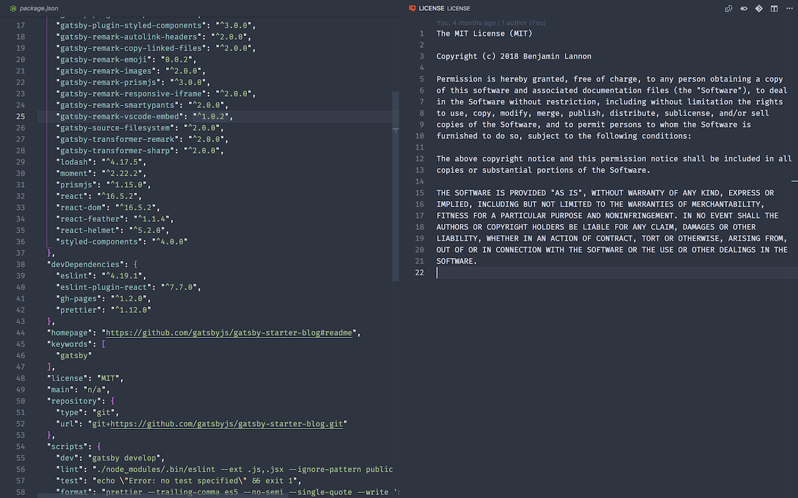
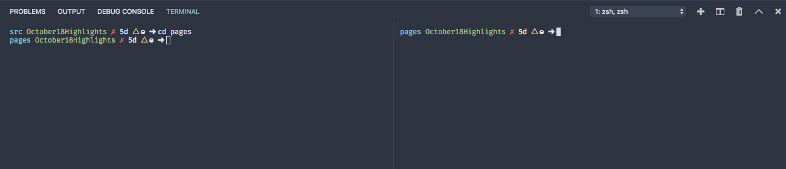

VS Code had its October Release today and with it came many new features. I wanted to dive into some smaller features that overall greatly enhance the quality of VS Code in this month's release. I’ll be going over an indicator for unsaved files, an enhancement to the zen/centered mode, and terminal directory inheritance.

<!-- end -->

# Dirty File Indicator

When you edit a file, the buffer is in a dirty state until you save. Before there was a circle in the tab indicating there are unsaved changes in a file. As of v1.29, there is now a colored top-border that will also indicate you have unsaved changes. This can be enabled by setting `workbench.editor.highlightModifiedTabs` to true. If you want to change the color, it can be modified in the `workbench.colorCustomizations` setting under the `tab.activeModifiedBorder` property and related theme colors to match the style of your theme or pop out at you saying the file hasn’t been saved.

Currently you can only change the color of the border. Overall it brings another visual cue that the file hasn’t been saved to disk and will be useful for some people in the future

# Zen Mode Enhanced

This month the team continued work on updating Zen Mode. Previously if you had a single file open, it would have padding on the left and right side of the display so the content would be in the center of your screen. With this centered layout, by default if you have two items in split view, it will shrink the two views which caused for a cramped layout which could be manually fixed by closing the left and right padding. As of the new update, when you have two editors side by side, they will take up the full width of the editor instead of being cramped in the middle of the display.

Zen mode is extremely useful for focusing in on a single file or two and this update cleans up some of the messy edges that came with the centered layout. If you had only one file open, it will stay in the centered layout. If you wish to go back to the old layout, change the `workbench.editor.centeredLayoutAutoResize` setting.

# Directory Inheritance in the Terminal Panel

For a few updates now, you can split the terminal view to have many terminals open in the panel. That said, if you opened a new terminal with `cmd+\`, it would open the root folder of the workspace. Now in the October release, the terminals will open in the directory the terminal to the left of it was so you don’t need to continuously dive into a deeply nested folder if you want multiple instances of it. You can modify this setting by editing `terminal.integrated.splitCwd`. In the user settings screen.

# Contributions from the Community

Over 200 people contributed this month from docs changes, code refactors, bug fixes, feature implementations, and localization efforts. It's a feat for the devs that get to have their features be in a product that millions of users use daily. Even for the small updates, it goes a long way for so many people and I congratulate everyone for helping out each month.

That's it for the week. Its always impressive to see features being pushed out month after month. Stay tuned for more content next week.