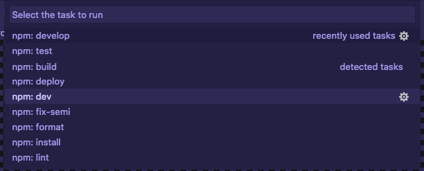
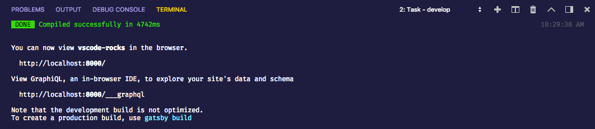
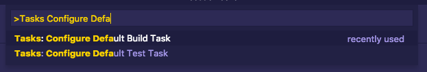
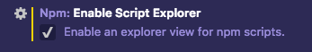
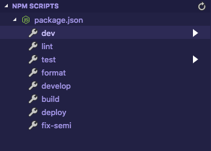

The task runner in Visual Studio Code allows tasks to be run to interact with your codebases. It has a huge benefit to run tasks without needing to switch over to a terminal to run a particular task. As well, VS Code supports NPM scripts by default in a variety of ways.

<!-- end -->

(If you're interested with the theme I am using, it is Shades of Purple by [Ahmad Awais](https://github.com/ahmadawais))

[Shades of Purple](https://marketplace.visualstudio.com/items?itemName=ahmadawais.shades-of-purple)

# Automating scripts for workflows

Building up scripts to run common tasks is a way to automate needing to write complicated commands into one-line statements.

If you are working with NodeJS, this is done with the `scripts` field in a project's package.json file. there are a few scripts that most people write such as `test` for running tests, `lint` to run linters, `dev` and `prod` to run applications in development or production modes, and `compile` or `build` to make a production-ready build of your application.

With VS Code, these NPM scripts are picked up by the task runner without needing any additional configuration. if you run the "Tasks: Run Task" action in the command palette, you will see a list of the NPM scripts in your project.

When you run any task, a terminal will appear in the panel at the bottom of your editor and will execute the script. Once it finishes, it will prompt you that you can close the terminal by pressing any key, but if you run the task again, it will use the same terminal.

# Binding often used tasks to the keyboard

Although you can do a few keyboard shortcuts to run the "Tasks: Run Task" action and then quickly search for the task, you can enable two tasks to be defaults. You are able to setup a default build task which you want to run when building your project as well as a default test task for running tests.

This can be done with the "Tasks: Configure Default Build Task" and "Tasks: Configure Default Test Task" actions through the command palette.

I find this useful with running unit tests. If you are running tests that take seconds to go through, you can set the default test task to run `npm test` for you and then it can run through your test runner in an instant. Then as described in my [Keyboard Shortcuts post](/keyboard-shortcuts/#bonus-your-own-keybindings), you can map this action to a keybinding so rather than opening the command palette, you can type a few keys to automate running tests. I personally have mapped the tests task to `cmd+k t` which allows me to go between working on code and running tests without almost any context switching.

# NPM Scripts Explorer

For those who prefer GUI based systems, as of the April 2018 release of VS Code ([V1.23](https://github.com/Microsoft/vscode-docs/blob/vnext/release-notes/v1_23.md)), There is a new viewlet that can be enabled in the Explorer view to display NPM scripts to be activated with a few clicks.

To enable this, open the User settings view and search for "Script Explorer" and you should see the following option below.

Once enabled, if you open it, the NPM Scripts viewlet will be put at the bottom of the Explorer view and you can view all of the created NPM scripts in the current workspace. click on the play button to the right of each one to activate them with ease.

# Customizing tasks

Out of the box, the tasks system is very convenient to run tasks that you've built already, but VS Code has good support to go beyond the default and create very custom tasks to be run through VS Code. That said, the syntax has a lot to go over and Microsoft has already written on this in depth. If you want to dig into this, head over to [Custom Tasks](https://code.visualstudio.com/docs/editor/tasks#_custom-tasks) on the docs site.

In summary, the Tasks system in VS Code integrates your scripts for projects directly into the editor. If you use other languages or tasks runners like Gulp or Grunt, they are also supported either out of the box or with an extension. It's a very small detail but can increase productivity a lot as you use it more and more.
