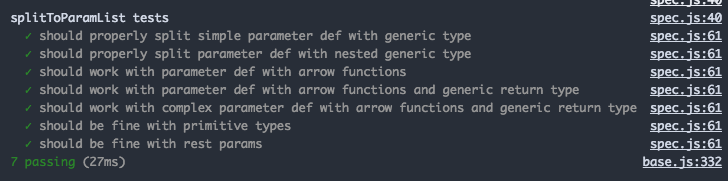

As I've been developing extensions for VS Code, writing tests has become useful to make sure the extension is doing what it is supposed to. With VS Code, the environment supports capabilities from simple unit tests to full-blown e2e testing. I will cover my experience and some tricks to know when testing your extensions.

<!-- end -->

# What should you test & getting started

With the question of "what should I test in my extension?", I would say it depends, but some good guidelines are if you have a chunk of code that does just one thing and isn't trivial, write some unit tests for it, and have a few e2e or integration tests for the key features of your extension.

The easiest way not just to setup testing but setting up a standard environment for VS Code Extension development is through the official [Yeoman Generator](https://github.com/Microsoft/vscode-generator-code). It scaffolds up all of the various default dependencies and template folders for a new VS Code extension. For this article, I will assume you are writing the extension with Typescript. The only difference between the TS and JS setups is that the tests will be in `test/` in JS setups and `src/test/` in TS setups.

If you haven't used it before, all you need to do is run the following commands in a terminal:

```
$ npm install -g yo generator-code
$ yo code
```

It will then run through an interactive prompt to setup your extension.

Next, let's look into the default setup for tests which can be found in the `src/test/` folder. The first file will be`index.ts` which is the script that VS Code will run to setup the testrunner. By default, it uses the [Mocha](https://mochajs.org/) test framework. The file will look like this:

```typescript
//
// PLEASE DO NOT MODIFY / DELETE UNLESS YOU KNOW WHAT YOU ARE DOING
//
// This file is providing the test runner to use when running extension tests.
// By default the test runner in use is Mocha based.
//
// You can provide your own test runner if you want to override it by exporting
// a function run(testRoot: string, clb: (error:Error) => void) that the extension
// host can call to run the tests. The test runner is expected to use console.log
// to report the results back to the caller. When the tests are finished, return
// a possible error to the callback or null if none.

import * as testRunner from 'vscode/lib/testrunner'

// You can directly control Mocha options by uncommenting the following lines
// See https://github.com/mochajs/mocha/wiki/Using-mocha-programmatically#set-options for more info
testRunner.configure({
  ui: 'tdd', // the TDD UI is being used in extension.test.ts (suite, test, etc.)
  useColors: true, // colored output from test results
})

module.exports = testRunner
```

This will run mocha on all files in the `src/test` folder that match `*.test.ts`. This will also work for any folder nested in the test folder. This is useful so if you want to have separate folders for different types of tests or different subsystems, they can be separated, and it will still work fine.

Next, there is a default unit test scaffolded for you to look at.

# Unit tests

The example test file, `extension.test.js` gives you a good usage of how to setup test suites.

```typescript
//
// Note: This example test is leveraging the Mocha test framework.
// Please refer to their documentation on https://mochajs.org/ for help.
//

// The module 'assert' provides assertion methods from node
import * as assert from 'assert'

// You can import and use all API from the 'vscode' module
// as well as import your extension to test it
// import * as vscode from 'vscode';
// import * as myExtension from '../extension';

// Defines a Mocha test suite to group tests of similar kind together
suite('Extension Tests', function() {
  // Defines a Mocha unit test
  test('Something 1', function() {
    assert.equal(-1, [1, 2, 3].indexOf(5))
    assert.equal(-1, [1, 2, 3].indexOf(0))
  })
})
```

As it states, the `vscode` module which exposes the entire extension API can be used in your tests, but that is mainly for end to end testing, so I will explain that in the next section.

Mocha supports the TDD format for test suites with the `suite` and `test` functions, but if you are used to `describe` and `it`, they are also supported here. As seen here, they give a very primitive test, but it shows off how to use mocha here.

Let me show off a real-world example from my JS/TS Annotations extension. Here's a snippet from a test suite which tests splitting a parameter list into individual parameters. (Full source here at [paramExtractor.test.ts](https://github.com/lannonbr/vscode-js-annotations/blob/master/src/test/unit/paramExtractor.test.ts)):

```typescript
import * as assert from 'assert'
import { splitToParamList } from '../../paramExtractor'

suite('splitToParamList tests', () => {
  test('should properly split simple parameter def with generic type', () => {
    const paramDef = 'op1: Opt<T, A>'
    const expectedList = ['op1: Opt<T, A>']
    const paramList = splitToParamList(paramDef)

    assert.deepEqual(paramList, expectedList)
  })

  test('should properly split parameter def with nested generic type', () => {
    const paramDef = 'op1: Opt<T, Test<A, B, C>, D>'
    const expectedList = ['op1: Opt<T, Test<A, B, C>, D>']
    const paramList = splitToParamList(paramDef)

    assert.deepEqual(paramList, expectedList)
  })

  test('should work with parameter def with arrow functions', () => {
    const paramDef = 'fn: (num: number, str: string) => string, opts: any'
    const expectedList = [
      'fn: (num: number, str: string) => string',
      'opts: any',
    ]
    const paramList = splitToParamList(paramDef)

    assert.deepEqual(paramList, expectedList)
  })

  // Rest of tests omitted
})
```

I first import the `splitToParamList` function that I want to test. In the suite, each test goes over an example where I have the parameters as a single string, the expected list of params, run the function and then assert that the result matches what I expected. They all are fairly simple, but I can now know that all of these various edge cases that appeared in a bug report will behave properly as I continue working on the extension.

To run this, open the Debug tab in VS Code and choose the "Extension Tests" launch configuration. This will open an instance of VS Code with your extension installed and then run any test suite. If all of your tests pass in the end, you will see some beautiful green checkmarks:



As well, given this is running through VS Code, you can put breakpoints in your code and debug it as expected (but do be warned that if you pause execution in your tests, they will timeout and cause a failing test, so be careful with such).

# End to End testing

Unit tests are good since they are simple, direct, and test only one thing, but in the case of vs code extensions, you also may want to write tests that show portions of your extension working correctly inside VS Code. As I said previously, when running tests, a complete instance of VS Code will open up and it allows you to open files and do anything by using the VS Code extension API.

I've written some e2e tests for my extension as well which can be found in full [here](https://github.com/lannonbr/vscode-js-annotations/blob/master/src/test/e2e/extension.test.ts):

```typescript
import * as assert from 'assert'
import * as path from 'path'
import * as vscode from 'vscode'
import * as Extension from '../../extension'

const testFolderLocation = '/../../../src/test/examples/'

suite('js annotations', () => {
  test('should annotate function with parameters', async () => {
    const uri = vscode.Uri.file(
      path.join(__dirname + testFolderLocation + 'normalParams.js')
    )
    const document = await vscode.workspace.openTextDocument(uri)
    const editor = await vscode.window.showTextDocument(document)
    await sleep(500)
    const [decArray, errDecArray] = await Extension.createDecorations(
      editor,
      editor.document.getText()
    )

    assert.deepEqual(decArray.length, 1)
    assert.deepEqual(errDecArray.length, 0)

    vscode.commands.executeCommand('workbench.action.closeActiveEditor')
  })

  // Rest of tests omitted
})
```

For each example, I open an example file and then run my extension on it and make sure the decorations arrays have a length that is expected. I could grab the entire object for the arrays, but it at least shows that this works.

Also, if you notice in the test, there is a `sleep` function that I run to make sure files load in fully before interacting with them:

```typescript
function sleep(ms: number): Promise<void> {
  return new Promise(resolve => {
    setTimeout(resolve, ms)
  })
}
```

There are some limitations to the API. For instance, I cannot grab text of the editor and all of the decorations in the editor at a time, but I still can test what decorations I am passing to the editor as seen above.

# Other tips

By default, VS Code will open up the debug instance with your extension as well as all other extensions you have active in your normal instance of VS Code. This can slow down the initial load, so to disable them, open the `.vscode/launch.json` file and inside the "Extension Tests" config, add "--disable-extensions" in the args section as seen here:

```json
{
  "name": "Extension Tests",
  "type": "extensionHost",
  "request": "launch",
  "runtimeExecutable": "${execPath}",
  "args": [
    "--disable-extensions",
    "--extensionDevelopmentPath=${workspaceFolder}",
    "--extensionTestsPath=${workspaceFolder}/out/test"
  ],
  "outFiles": ["${workspaceFolder}/out/test/**/*.js"],
  "preLaunchTask": "npm: watch"
}
```

As well, given you have to spin up a VS Code instance and run tests that may take a bit to load things into the editor, Mocha may timeout with its default config of 2000ms. In the options object in the testrunner file (`index.ts` in your test folder), I would recommend updating it to however long you will need for your tests. with the `timeout` key.

That wraps it up for this week. If you have any further questions on testing VS Code Extensions, reach out to me at [@lannonbr](https://twitter.com/lannonbr) on Twitter.
