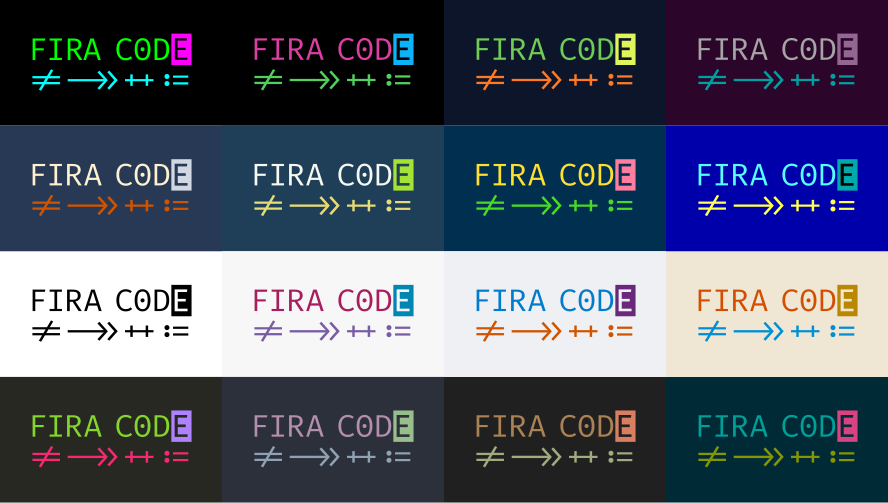
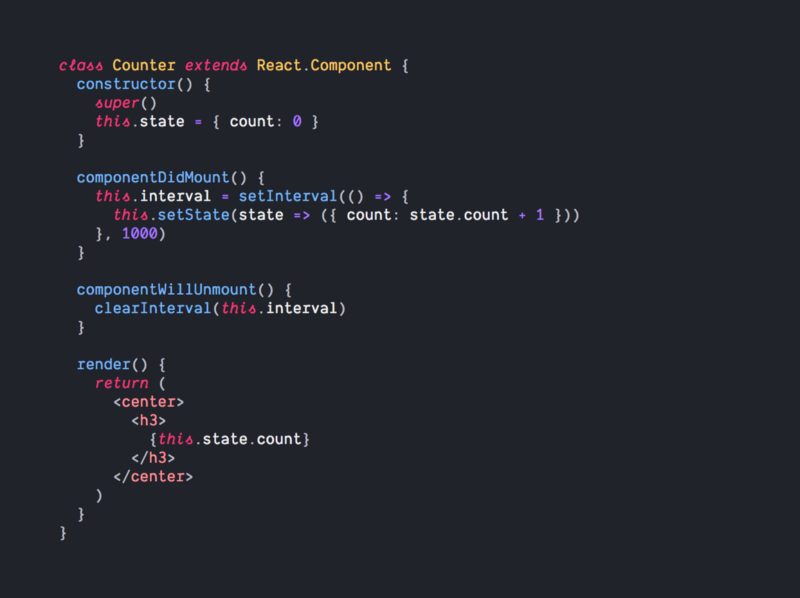

If VS Code is your main editor, having a clean UI can bring a productivity boost. Changing the typography can help give cleaner text and allow you to focus on the content at large rather than the text alone. I am going to go over some neat fonts as well as some other tweaks to 1-up your VS Code typography skills.

<!-- end -->

As well, given this is my first post in 2019, I want to wish everyone a happy new year. I took a hiatus to give myself a bit of time to rest during the holidays but I am back now and will be back to the weekly schedule.

# Configurable Font settings

Starting out trying to figure out what settings are configurable can be done by opening the Settings UI (`cmd+,` or `ctrl+,`) and searching for "font". The ones that I've found that are of main customize include the following.

- **Font family**: The font family can be changed to any font that is installed on your system. I'll get into a few fonts others and I recommend.
- **Font size**: the size of the font in pixels. Given I have a large display, I tend to have my font size at 18px so it is fairly reasonable to read from a distance.
- **Font weight**: The weight of a font whether you wish for a thin or bolder font style. It maps to 100-900 similar to the font-weight CSS attribute.
- **Line height**: This defines the line height in pixels of the font. The default is 0 which means it will use the default line height of the font according to the font size it is at currently, but it can be customized if you want the lines spaced out even further.

# Recommended Font Families

There are plenty of fonts that are made specifically for coding. The ones I am recommending go between free to commercial licenses for the font, so don't go out of your budget to buy one of these fonts if you cannot afford it.

First off is a free font named [Fira Code](https://github.com/tonsky/FiraCode). It is a font developed by Nikita Prokopov which was based on Fira Mono which was developed by Mozilla for Firefox. If you notice, the font includes Ligatures which I will get into later. This is the font I particularly use and gives a crisp feel to the text.

Next is [Dank Mono](https://dank.sh/) which was developed as another coding font. It's a commercial font but it only costs £40 for a license which is about $50 USD. Compared to Fira Code, Dank Mono, which you also will see in a few other fonts, has italicized all of the keywords across various languages so you can differentiate keywords from variables or function names.

Finally, [Operator](https://www.typography.com/fonts/operator/styles/) is the last font. It has a similar feel to Dank Mono but is a much more full fleshed font that you can also use in graphic design. While Dank Mono has only two font styles, Operator has a bunch of fonts including it's a monospace style to be used in text editors. That said, given it is a more full-fleshed font, the license costs between $200-$600 so it can get fairly expensive, but given you look at your editor all day, it may be a good expense. As I said previously, don't overdo it if it is not in your regular budget.

# Font Ligatures

As mentioned earlier, Fira Code has a concept of Font Ligatures. As seen in the image above, sets of symbols can switch into custom characters when displayed. For instance, when you write `!=`, fonts that include ligatures, it will be converted to an equals sign with a slash in the middle of it as if you'd write it in a mathematical expression. There are plenty of other ligatures across various languages and give a cleaner look to visualize the symbol as a single item rather than the individual characters. To enable this, search for "Font Ligatures" in the settings panel and click on the checkbox to enable it. With such, the font family needs to support font ligatures to have ligatures be displayed.

Overall, having a clean font to read when using VS Code is one of those essentials that you don't think about often, but helps out in the long run.
