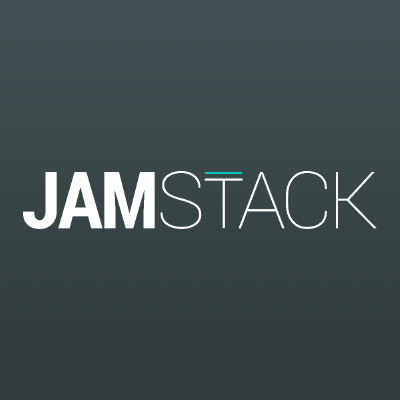
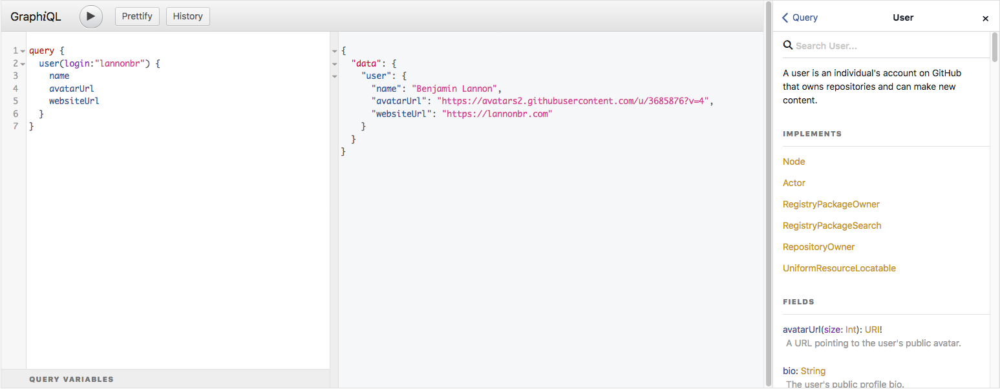
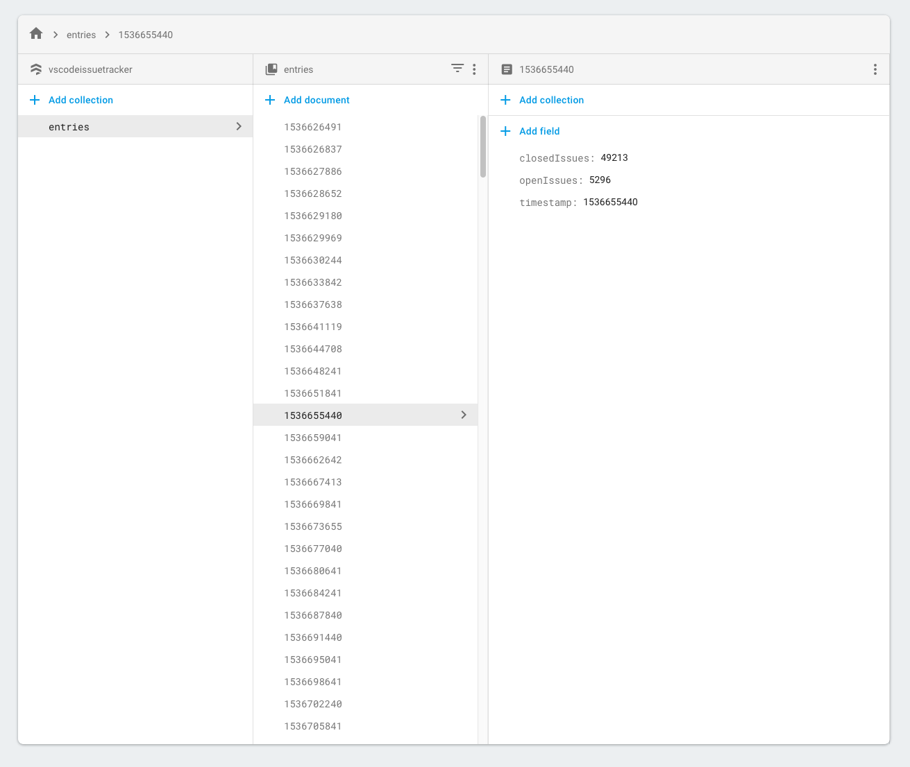
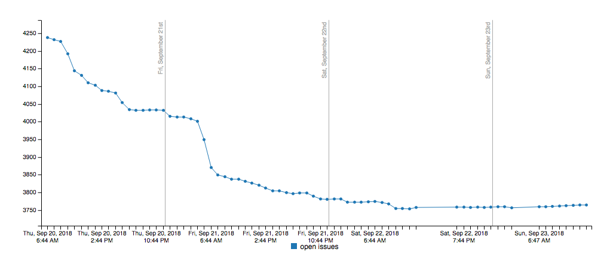

With the 1.28 release of VS Code, the team wished to clean up the issues on the Github Repo. There was over 5000 open issues and I decided to create a visualization to see the progress on cleaning up the open issues. This article goes into how I made this website using the JAMstack.

<!-- end -->

# The Idea

The simplest way to describe the [VS Code Issue Tracker](https://vscode-issue-tracker.netlify.com/) is it will display graphs of the number of open issues over a period of time. I was able to get it up and working in just a couple of nights and have been slowly incrementing on the project since. Other than some of the config setup of the various services I used to develop this, you can find the source for the majority of the frontend and backend of this project on Github at [lannonbr/vscode-issue-tracker](https://github.com/lannonbr/vscode-issue-tracker/).

# What's the JAMstack?



Over the past few years, an emerging market has been rising for the idea of creating fast and efficient sites using Javascript, APIs, and Markup (the JAM of Jamstack). As described on the main site for [JAMstack](https://jamstack.org/), it is not a specific stack compared to things like MEAN or LAMP stacks, but more a philosophy for developing static sites that become dynamic with clientside JS and APIs.

A lot of various sites have been built with this mindset including [Smashing Magazine](https://www.smashingmagazine.com/), Docs for [Lodash](https://lodash.com/), and businesses have built their entire mindset around the JAMstack, like [Netlify](https://www.netlify.com/). The main use case I've used the JAMstack for is content-based sites including this site you are reading this on as well as the VS Code issue tracker. for more complex web apps I do still think server-based stacks are perfectly acceptable and with most software, the stack to write a project will always depend on the context.

Onto the project iself, the mindset was to log the data from Github on the issue count every hour and then display it on a website and is split between the code to grab and store the issue count as well as the frontend which visualizes it.

# The Backend

The backend for the issue tracker consists of two main portions: the data collector and the database which it stores said data. Although I could run this on one cloud, given I am used to various parts of many different clouds, I decided to develop the architecture for this project across clouds just because I am used to the various services and was able to get the project up and running quickly. There are tons of different platforms that do the same things that I will discuss, so if you want to make something similar to this project and you are more comfortable with some other service than what I use, go ahead.

Starting out with the data collector, Github started developing in late 2016 a GraphQL API to replace their V3 REST API. It is now their main API endpoint as of 2017. What makes it different compared to the V3 API is rather than hitting many endpoints is you hit `https://api.github.com/graphql` with an access token and build up a query of what you want and it will respond with a JSON payload that is almost identical in structure to the query.

If you haven't used GitHub's new API before, they have an API explorer where you can test the API out using GraphQL's GraphiQL editor which gives query autocompletion and built in docs as seen below. The API explorer can be found at https://developer.github.com/v4/explorer/ which just requires you to login with GitHub.



With this API, I wrote a short serverless function which runs on AWS Lambda to grab the data from the Github API. I send a fetch request with the following GraphQL to the API to get the number of open issues:

```graphql
query {
  repository(owner: "Microsoft", name: "vscode") {
    issues(states: OPEN) {
      totalCount
    }
  }
}
```

I do the same to get the number of closed issues as well by changing the `states` parameter in the issues field to CLOSED.

Next, once the two reqeusts return with the data I want, I send the data to a NoSQL database, [Cloud Firestore](https://firebase.google.com/docs/firestore/) which runs on Google's Firebase platform. I chose Firestore so I could spin up a database extremely quickly and given I am only grabbing the data once an hour, It is a very small amount of data that doesn't need a complex database to be running.



Each entry has the unix timestamp of when I grabbed the data as well as the number of open and closed issues on the repository. After setting everything up, the Lambda function will run once an hour and record the issue count at that time to then be consumed by the frontend.

# The Frontend

The frontend is a fairly straightforward page that will grab the data from Firestore and pull it down using the Firebase client-side sdk to be pushed into a line chart. I could have used some kind of framework for the site, but given how small in scope this project is, using regular HTML, CSS, and JS with a few external libraries was just an easier approach.



For the graph library, I went with [C3.js](https://c3js.org) which is a wrapper on D3 that exposes many prebuilt charts. So far, I have 2 graphs that show the last 3 days as well as every 10 days, and I am planning on making the charts scrubbable and more customizable in the future.

After developing the site locally, I pushed the site up to Netlify which will deploy updates I make to the GitHub repo for the project automatically and will be hosted across their CDN. With such, Netlify issued an SSL certificate so it is running on HTTPS by default. Lastly, Netlify also can push [preview deploys](https://www.netlify.com/blog/2016/07/20/introducing-deploy-previews-in-netlify/) so if someone makes a PR, you can preview the site running live before merging the PR in.

# Results

After letting this run continuously for over 10 days, I've been finding that the VS Code team has been fairly successful with their progress. As stated on the site as of when I wrote this, they started with over 5000 issues open and now have closed over 2000 issues since.

Development-wise with this project, I was able to spin up a visualization using an external API with fairly little issues and at no cost. There is a bit of setup given the broad set of services, but once everything was working, there is very little maintenance that I need to do personally. This architecture can be used in many different scenarios and as I continue to progress I may make it easier to set this workflow up as I create new projects with it.

That's it for the week. For more info, feel free to go to any of the links below:

* GitHub Repo: https://github.com/lannonbr/vscode-issue-tracker/
* Site: https://vscode-issue-tracker.netlify.com/
* Issue that made me come up with this idea: https://github.com/Microsoft/vscode/issues/58336
