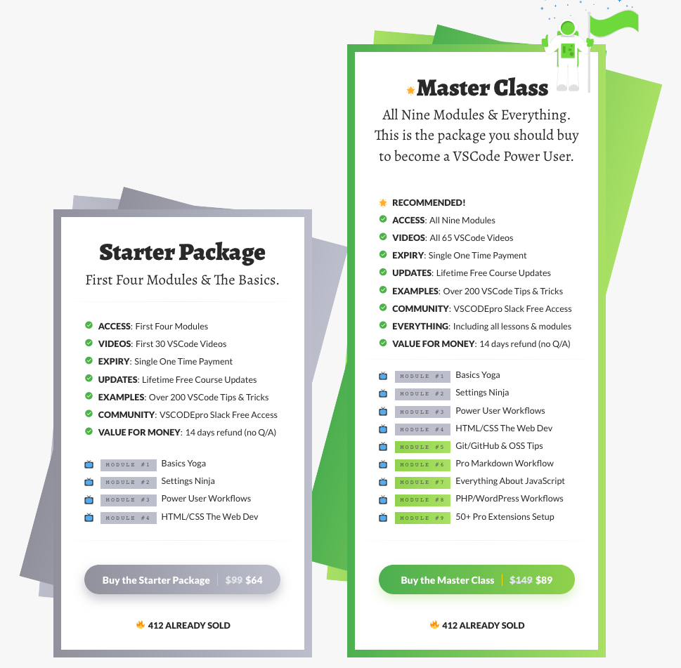

VS Code has spun up from a simple idea of making a web based text editor in Typescript to a piece of software millions of devs use. It’s simple to start but can be extended deeply and you always can learn more content along the way. This past weekend, Open Source Developer Advocate Ahmad Awais released his VS Code Power User video course after a year of work and it is definitely worth the wait.

<!-- end -->

Ahmad has been a long running member of the open source community. From being an avid contributor to the WordPress Core project, developer of WP themes and plugins with over 500k installs, to hundreds of projects on GitHub, Ahmad has pushed a huge amount of content into the Open Source community. Across his time in the community, Ahmad has also pushed a huge amount of content out and is a teacher at heart. With the work he’s done, he has gotten huge amount of praise from many people in the community including React core developer, Dan Abramov, WordPress Co-founder, Matt Mullenweg, WomenWhoCodeDC Tech Director Ali Spittel, and many others.

Recently, Ahmad took the plunge and switched over from Sublime Text over to VS Code. He took a deep dive into learning the ecosystem and after a while, he decided to create a course to teach others on tips to truly learn VS Code. After a year of work, Ahmad finally released VS Code Power User. It’s a 5 hour course that teaches you a huge amount of knowledge and after going through it myself, I can state that even as a fairly advanced user of VS Code, Ahmad taught me some neat tricks that I immediately am integrating into my workflow now.

# About the Course

Ahmad’s focus on the course is given your text editor is one of the most essential tools of a developer’s toolchain so deeply learning it can save you dozens of hours a month. The course does exactly that in a way that allows you to learn in bite-sized videos. There’s over 60 videos that are usually under 10 minutes each which is extremely convenient if you want to just watch a few videos on a train commute or during lunch. With this, you get a deep insight on a small amount of content per video which allows the content to be extremely digestible for any pace. As well, with speed control, if it is going too fast or slow you can change the pace to what suits you.

I think what could be improved could include a few paragraphs summarizing the video as well as links to extensions discussed in each, although overall I enjoyed the structure of how the course was laid out at large.

# What Package should I get?

Currently as of writing this in November 2018 when the course launched, Ahmad released a starter and master package starting at $64 and $89 respectively. Each one is a one time purchase and the main difference between the two is the amount of content. In the full package, you get all 9 modules compared to the first 4 in the starter package. In terms of content, that is approximately 3 more hours compared to the starter package that has 2 hours.

In terms of content, there are a few topics that every developer may not get a huge amount of content out of with the 5 master class only package, such as the JS module or PHP module if you aren’t a web developer, but where I do see the benefit is in the other modules on things like Markdown, Git, and the extensions which are useful for any developer. With that, I would recommend the master class, but if you think the first modules are good enough for you, then go with the starter package. Lastly, if you are looking to get a team package or are a student, [Contact Ahmad](https://ahmadawais.com/contact/) if you are looking for a discount.

# Conclusion

From the beginner to advanced user of VS Code, I would highly recommend getting this course. Ahmad created 5 hours of content that can be easily digestible for a long watching session or a short lunch break to consume some tips. He’s worked on it for a year and it shows the effort he put into such a product.

If you wish to purchase the course, head over to [vscode.pro](https://a.paddle.com/v2/click/16413/37005?link=1227) to get access. This affiliate link will greatly support both Ahmad and this blog.
