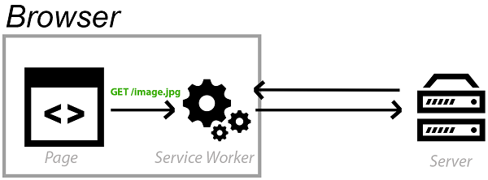

This past week, I’ve pushed two new features to make the site both more efficient as well as work offline. They are almost invisible to the eye but can bring further efficiency to the page

<!-- end -->

VS Code Rocks is powered on [Gatsby](https://www.gatsbyjs.org/), a static site generator that uses React and the [JAMstack](https://jamstack.org/). With this, I write articles using markdown and it is built to a static website that can be deployed to a CDN. The repo for VS Code Rocks is on GitHub here: https://github.com/lannonbr/VSCode-rocks

This past week, I introduced two upcoming web platform apis that enhance the site as well as increase it’s efficiency: Service Workers and WebP images.

# Service Workers

3 years ago, Alex Russell and Frances Berriman coined the term PWA or Progressive Web App. It was a term to centralize a mindset of making websites be progressively enhanced by modern web technologies so the old browsers have a good base experience but new browsers allow even better experiences.

The main tool that powers PWAs is the Service Worker. In essence, you can think of it as a proxy that lives between the network and the browser that can handle network flows. With this, you are able to do things like cache assets on your machine and have the ability to even load the website when your network connection is flakey or even offline. Service Workers now have basic support in all four main browser engines, so I decided to hook into the api.

In reference to VS Code Rocks, content doesn’t often change after it being published, so if I can cache it to someone’s device, it will load faster on subsequent loads and even if your network is down, the content is still available. Gatsby has a plugin called [gatsby-plugin-offline](https://www.gatsbyjs.org/packages/gatsby-plugin-offline/) which provides an effortless tool to generate a service worker to cache all of your routes. It uses [Workbox](https://developers.google.com/web/tools/workbox/) which was a library to create service workers by Google. The Gatsby plugin can be extended to define custom caching strategies for your routes, but for myself, I have stuck with the standard options for now.

# WebP

The second feature I looked into was WebP. It’s an image standard that is being made to be more efficient compared to PNG / JPEG formats. For awhile it was only supported in Chrome but it is gaining traction with Edge 18 and Firefox 65, so I went ahead to implement it. The images look exactly the same on the frontend but are almost always smaller in file size which will reduce the bandwidth usage as well as time till the site is loaded. To implement WebP on my site, the [Gatsby Image](https://www.gatsbyjs.org/packages/gatsby-image/) component supports WebP and will use the [picture](https://developer.mozilla.org/en-US/docs/Web/HTML/Element/picture) element so if your browser doesn’t support WebP, it will fallback to a format that the browser does support.

Even though it is slowly coming to other browsers other than Chrome, implementing it now with the fallbacks with the old browsers pushes a model of not needing to do any maintenance on my end when the new browsers begin supporting it.

# Summary

Overall, the two features I implemented aren’t huge in scale. There’s no huge makeover to the design or usage of the site, but rather, these are slow incremental updates that continually push the site forward. With that, pushing these features to the newer browsers allows a focus of delivering rich content that is accessible on a variety of platforms and enhance it as new features are supported in newer browsers.
